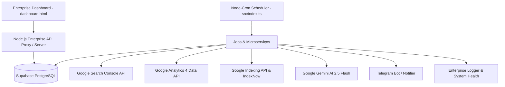

# Arquitetura do Sistema - Search Console Automation 3.0 Enterprise

Este documento mapeia detalhadamente a arquitetura, estrutura de arquivos, serviços, agendadores, banco de dados, APIs de terceiros e integração de inteligência artificial da plataforma **Search Console Automation 3.0 Enterprise**.

---

## 1. Visão Geral da Arquitetura

O sistema é construído como uma aplicação híbrida **Node.js (TypeScript) + Frontend SPA Enterprise (HTML5/CSS3/Vanilla JS)** alimentado por **Supabase (PostgreSQL)**, **Google Search Console API**, **Google Analytics 4 Data API**, **Google Indexing API**, **Google Gemini 2.5 Flash AI** e **Notificações Telegram Bot**.



---

## 2. Componentes e Estrutura de Arquivos

```
search-console-automation/
├── ARCHITECTURE.md             # Documentação técnica da arquitetura (ETAPA 1)
├── dashboard.html              # Frontend Enterprise Dashboard (SPA)
├── package.json                # Dependências Node.js e scripts de build
├── tsconfig.json               # Configurações do compilador TypeScript
├── supabase_schema.sql         # Schema relacional e índices do Supabase PostgreSQL
├── logs/                       # Diretório de observabilidade (ETAPA 2)
│   ├── system.log              # Logs gerais do sistema
│   ├── cron.log                # Logs de execuções dos agendamentos
│   ├── gsc.log                 # Logs de requisições ao Search Console
│   ├── ga4.log                 # Logs de requisições ao Google Analytics 4
│   ├── gemini.log              # Logs de interações com a IA Gemini
│   ├── telegram.log            # Logs de mensagens e aprovações no Telegram
│   └── errors.log              # Logs de erros e stack traces
├── src/
│   ├── index.ts                # Ponto de entrada do serviço e inicialização do scheduler
│   ├── config/
│   │   ├── env.ts              # Validação de variáveis de ambiente com Zod
│   │   ├── google.ts           # Configuração da autenticação OAuth2 do Google
│   │   ├── sites.ts            # Lista das propriedades monitoradas
│   │   └── supabase.ts         # Conexão com o Supabase com suporte a Realtime
│   ├── services/
│   │   ├── logger.ts           # Sistema profissional de logs em arquivos (ETAPA 2)
│   │   ├── cache.ts            # Cache enterprise em memória com TTL e Stale-While-Revalidate (ETAPA 4)
│   │   ├── resilience.ts       # Circuit Breaker, Retry com Exponential Backoff e Fallbacks (ETAPA 5)
│   │   ├── systemStatus.ts     # Coleta de métricas do sistema (CPU, RAM, Uptime) (ETAPA 3)
│   │   ├── seoScore.ts         # Algoritmo de SEO Score (0-100) em 15 vetores (Fase 3)
│   │   ├── ga4Analytics.ts     # Integração estendida com Google Analytics 4 (Fase 4 & ETAPA 10)
│   │   ├── predictiveAi.ts     # Previsões e análises preditivas com Gemini AI (Fase 5)
│   │   ├── opportunities.ts    # Matriz de Oportunidades por Impacto e ROI (Fase 6 & ETAPA 8)
│   │   ├── keywordsExplorer.ts # Top Keywords e intenção de busca (Fase 8)
│   │   ├── aiDailyInsights.ts  # Relatórios em linguagem natural estilo ChatGPT (Fase 9 & ETAPA 9)
│   │   ├── seoDiagnostics.ts   # Diagnósticos avançados de Canibalização e Thin Content (ETAPA 11)
│   │   ├── pipeline.ts         # Pipeline automático de Rebuild, Deploy e Indexação (ETAPA 12)
│   │   ├── alerts.ts           # Alertas proativos via Telegram e WhatsApp (ETAPA 13)
│   │   ├── backup.ts           # Backup automático de configurações e tabelas (ETAPA 14)
│   │   ├── monitoring.ts       # Health check, watchdog e observabilidade (ETAPA 10 & 15)
│   │   ├── searchAnalytics.ts  # Serviço de busca do Google Search Console API
│   │   ├── urlInspection.ts    # Inspeção de URLs no Search Console
│   │   ├── indexingApi.ts      # Envio de URLs para a Google Indexing API e IndexNow
│   │   ├── gemini.ts           # Integração de copywriting e diagnósticos com Gemini AI
│   │   ├── notifications.ts    # Formatação de alertas e bot Telegram
│   │   └── telegramListener.ts # Escuta de comandos e botões inline no Telegram
│   ├── jobs/
│   │   ├── dailyPerformanceJob.ts # Rotina diária de coleta de performance GSC
│   │   ├── urlAuditJob.ts         # Auditoria de indexação de páginas
│   │   ├── sitemapCheckJob.ts     # Verificação de sitemaps XML
│   │   ├── rebuildWebsitesJob.ts  # Reconstrução estática SSG de sites
│   │   ├── trackPerformanceJob.ts # Acompanhamento Antes vs Depois de otimizações
│   │   └── autoRemediateJob.ts    # Auto-cura de erros e solicitação de reindexação
│   └── analyzers/
│       ├── ctrOpportunities.ts # Identificador de URLs com CTR abaixo da média
│       ├── indexingIssues.ts   # Classificador de erros de cobertura no GSC
│       └── trafficDrops.ts     # Detector de quedas bruscas de tráfego
└── tests/                      # Suíte de testes unitários e de integração (ETAPA 19)
    ├── cache.test.ts
    ├── resilience.test.ts
    ├── seoScore.test.ts
    └── scheduler.test.ts
```

---

## 3. Fluxo de Dados e Integração de Serviços

1. **Agendamento Autônomo**:
   * O `node-cron` dispara rotinas diárias e periódicas registradas em `src/index.ts`.
   * Cada execução é envolvida por um **Circuit Breaker** com **Retry + Backoff Exponencial** e registra logs no diretório `logs/`.
2. **Coleta de Métricas**:
   * Requisições ao GSC (`searchconsole.v1`) e GA4 (`analyticsdata.v1beta`) passam pelo **Memory Cache Enterprise** com TTL.
   * Os dados agregados são salvos no Supabase nas tabelas `gsc_performance`, `ga4_metrics`, `seo_scores` e `seo_predictions`.
3. **Inteligência Artificial (Gemini 2.5 Flash)**:
   * Oportunidades de baixo CTR são enviadas ao Gemini para reescrita persuasiva de títulos e meta descriptions.
   * Resumos diários em linguagem natural são gerados e armazenados em `ai_daily_insights`.
4. **Aprovação & Pipeline Automático (ETAPA 12)**:
   * Aprovações ocorrem via Web Interface ou Telegram Bot.
   * A aprovação engatilha a reconstrução do site estático (SSG), re-geração de sitemaps e envio de pings para a Google Indexing API.
5. **Painel Web (Dashboard SPA)**:
   * `dashboard.html` consome métricas do banco de dados e exibe 12 abas Enterprise de observabilidade, históricos, comparações, diagnósticos de SEO e saúde do servidor.

---

## 4. Banco de Dados Supabase (Schema Resumido)

* **`gsc_performance`**: Histórico diário de cliques, impressões, CTR e posição por página e query.
* **`gsc_indexing_audit`**: Auditoria e histórico de auto-cura de cobertura de URLs.
* **`gsc_sitemaps`**: Registro e verificação de sitemaps XML.
* **`seo_overrides`**: Títulos e metadados otimizados pela IA (pendentes e aprovados).
* **`seo_scores`**: Scores calculados de 0 a 100 por site (15 vetores).
* **`ga4_metrics`**: Métricas de usuários, sessões, engajamento e conversões GA4.
* **`seo_predictions`**: Previsões de CTR futura, cliques e diagnósticos com Gemini AI.
* **`seo_opportunities`**: Matriz de oportunidades categorizadas por alto/médio/baixo impacto.
* **`seo_keywords`**: Top keywords, intenção de busca (Transacional/Informativa) e dificuldade.
* **`ai_daily_insights`**: Resumos diários executivos em linguagem natural.
* **`system_logs`**: Logs de sistema, observabilidade e latência das APIs.

---

## 5. Garantia de Compatibilidade Retroativa

* Todas as funções existentes mantêm suas assinaturas de chamada originais.
* Novos serviços são criados de forma modular e desacoplada em `src/services/`.
* A compilação é estritamente validada via `npm run build` (`tsc`) garantindo 100% de integridade em produção.
