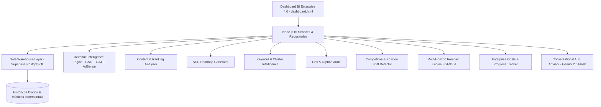

# Arquitetura do Sistema - Search Console Automation 4.0 Enterprise BI

Este documento especifica a arquitetura da camada de **Business Intelligence (BI)** introduzida na versão **4.0 Enterprise**.

---

## 1. Visão Geral da Arquitetura BI 4.0

A versão 4.0 adiciona uma camada completa de **Data Warehouse, Inteligência Financeira (Revenue Intelligence), Análise de Conteúdo, Heatmaps de SEO, Forecast Preditivo e Consultoria Conversacional com IA** sobre o ecossistema existente da versão 3.0.



---

## 2. Estrutura de Módulos BI 4.0 (`src/bi/`)

Para garantir **100% de desacoplamento e zero risco de regressão**, todos os novos componentes da versão 4.0 foram estruturados no módulo dedicado `src/bi/`:

```
src/bi/
├── dataWarehouse.ts       # Camada de persistência histórica incremental (Fase 1)
├── executiveSummary.ts     # Gerador do Score Executivo (0-100) e Visão Geral (Fase 2 & 13)
├── growthAnalytics.ts     # Análise de Tendência, Aceleração e Janelas (Fase 3)
├── contentIntelligence.ts # Ranking de artigos, páginas em queda e candidatas a atualização (Fase 4)
├── seoHeatmap.ts          # Gerador de Mapa de Calor de URLs (Verde/Amarelo/Laranja/Vermelho) (Fase 5)
├── revenueIntelligence.ts # Cruzamento GSC + GA4 + AdSense e ROI por página/query (Fase 6)
├── keywordCluster.ts      # Clusters de palavras, ganhos/perdas e quase Top 3 (Fase 7)
├── linkIntelligence.ts     # Mapeamento de links internos, órfãs e broken links (Fase 8)
├── competitiveInsight.ts  # Detecção de mudanças de posição e ultrapassagens (Fase 9)
├── conversationalAi.ts    # Painel de Perguntas e Respostas de Negócio com Gemini (Fase 10)
├── forecastEngine.ts      # Projeções preditivas para 30, 60, 90, 180 e 365 dias (Fase 11)
├── goalsTracker.ts        # Gestão de metas mensais, trimestrais e anuais (Fase 12)
├── pdfReportGenerator.ts  # Gerador de relatórios executivos e técnicos em PDF/Markdown (Fase 14)
└── biOrchestrator.ts      # Orquestrador central de Business Intelligence (Fase 15)
```

---

## 3. Fluxo Integrado de Dados BI

1. **Coleta Incremental no Data Warehouse**:
   * Todos os dias, as rotinas capturam métricas de GSC, GA4, SEO Score, Indexação e Receita e gravam tabelas histócicas no Supabase sem substituir registros anteriores.
2. **Engenhos Analíticos (BI Engine)**:
   * **Revenue Intelligence**: calcula receita por página = `(Cliques GSC * Conversões GA4 * RPM AdSense)`.
   * **SEO Heatmap**: classifica cada URL no vetor verde (>85), amarelo (70-84), laranja (50-69), vermelho (<50) ou cinza (sem dados).
   * **Multi-Horizon Forecast**: projeta métricas de 30 a 365 dias via regressão de tendência e sazonalidade.
3. **Conversacional IA (Gemini 2.5 Flash)**:
   * O usuário pode formular perguntas estratégicas (*"Qual categoria cresce mais?", "Onde devo investir?"*) e a IA responde em linguagem natural correlacionando GSC, GA4 e o Data Warehouse.

---

## 4. Garantia de Compatibilidade Retroativa

* Todo o código da versão 3.0 permanece intacto.
* Novos serviços são puramente **aditivos**.
* A suíte de testes `npm test` valida os módulos existentes e novos sem regressão.
