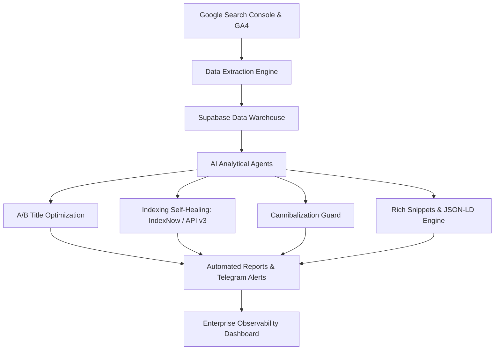

# 🔍 Search Console Automation — Enterprise SEO & BI Engine

[](https://github.com/alessandrooliveirape-prog/search-console-automation)
[](LICENSE)
[](https://nodejs.org/)
[](https://www.typescriptlang.org/)
[](https://cloud.google.com/)
[](https://supabase.com/)
[](https://ai.google.dev/)

An autonomous multi-domain search intelligence and automated SEO remediation suite. Combines the **Google Search Console API**, **Google Analytics 4 Data API**, and **Gemini AI** to automate title A/B testing, indexation repair, keyword cannibalization detection, and predictive traffic forecasting.

---

## 🌟 Core Modules & Architecture



### 1. 🧪 Automated A/B Testing for Titles & Metadata
* **Pre/Post 14-Day Impact Analysis:** Tracks empirical CTR and click variances before and after metadata updates.
* **Algorithmic Outcome Categorization:** Classifies experiments into *Winner*, *Neutral*, or *Underperformer*.
* **Automated Rollback Safeguard:** Detects sudden traffic decay and restores original metadata to prevent organic ranking loss.

### 2. ⚔️ Keyword Cannibalization Guard
* Detects when two or more URLs from the same domain split impressions and compete for identical search queries.
* Recommends automated resolution actions: **301 Canonical Redirect**, **Intent Disambiguation**, or **Internal Anchor Link Adjustment**.

### 3. 🩺 Indexing Self-Healing & API v3 Remediation
* Proactively queries Google Search Console URL Inspection API for *Crawled - currently not indexed*, *Discovered*, or *Soft 404* errors.
* Automatically submits verified URLs via **Google Indexing API v3** and **IndexNow protocol** (Bing, Yandex) to accelerate re-crawl lifecycles.

### 4. 📊 Data Warehousing & Predictive Traffic Modeling
* Daily snapshot persistence in Supabase (`bi_daily_warehouse`).
* Generates 30, 60, 90, and 180-day trajectory projections using time-series regression and seasonal baseline adjustments.

### 5. 🖥️ Enterprise Observability Dashboard (`dashboard.html`)
* High-performance Single Page Application (SPA) providing real-time data inspection across CTR performance, indexing health, keyword shifts, and automated publication feeds.

---

## 🛠️ Tech Stack

| Layer | Technologies |
|---|---|
| **Runtime & Logic** | Node.js (18+), TypeScript, `tsx` runner |
| **APIs Integrated** | Google Search Console API v3, Google Analytics 4 (Data API v1beta), Google Indexing API v3, IndexNow |
| **Generative AI** | Google Gemini API (`@google/genai`) |
| **Data Warehouse** | Supabase (PostgreSQL, Row Level Security, Automated Schemas) |
| **Alerting & Notification** | Telegram Bot API, CallMeBot WhatsApp Gateway |
| **Frontend UI** | Modern Vanilla CSS, Chart.js, Glassmorphic responsive layout |

---

## 🚀 Getting Started

### Prerequisites
* **Node.js** 18+ and **npm**
* A Google Cloud Project with Search Console & GA4 Data APIs enabled
* Supabase project credentials

### 1. Clone the Repository
```bash
git clone https://github.com/alessandrooliveirape-prog/search-console-automation.git
cd search-console-automation
```

### 2. Configure Environment Variables
Copy `.env.example` to `.env`:
```bash
cp .env.example .env
```
Populate the configuration with your API credentials:
```env
# Google Cloud Credentials (OAuth2 or Service Account)
GOOGLE_CLIENT_ID="your-client-id"
GOOGLE_CLIENT_SECRET="your-client-secret"
GOOGLE_REFRESH_TOKEN="your-refresh-token"

# Supabase
SUPABASE_URL="https://your-project.supabase.co"
SUPABASE_SERVICE_KEY="your-supabase-service-role-key"

# Gemini AI (for metadata optimization)
GEMINI_API_KEY="your-gemini-api-key"
```

### 3. Install Dependencies
```bash
npm install
```

### 4. Execute Audits & Automation Routines
```bash
# Run daily metrics sync and inspection
npm run start

# Generate executive BI reports with cause attribution
npm run report:weekly

# Launch local dashboard server
npm run dashboard
```

---

## 🔒 Security Best Practices
* **Zero Client-Side Master Credentials:** The client dashboard accepts read-only configuration via injected environment variables or safe backend proxy.
* **Strict `.gitignore` Policy:** All `.env` files, OAuth refresh tokens, and Google Cloud service account keys are excluded from git versioning.

---

## 👤 Author & Status
* **Author:** [Alessandro Oliveira](https://github.com/alessandrooliveirape-prog)
* **Status:** Independent Project
* **License:** [MIT License](LICENSE)
